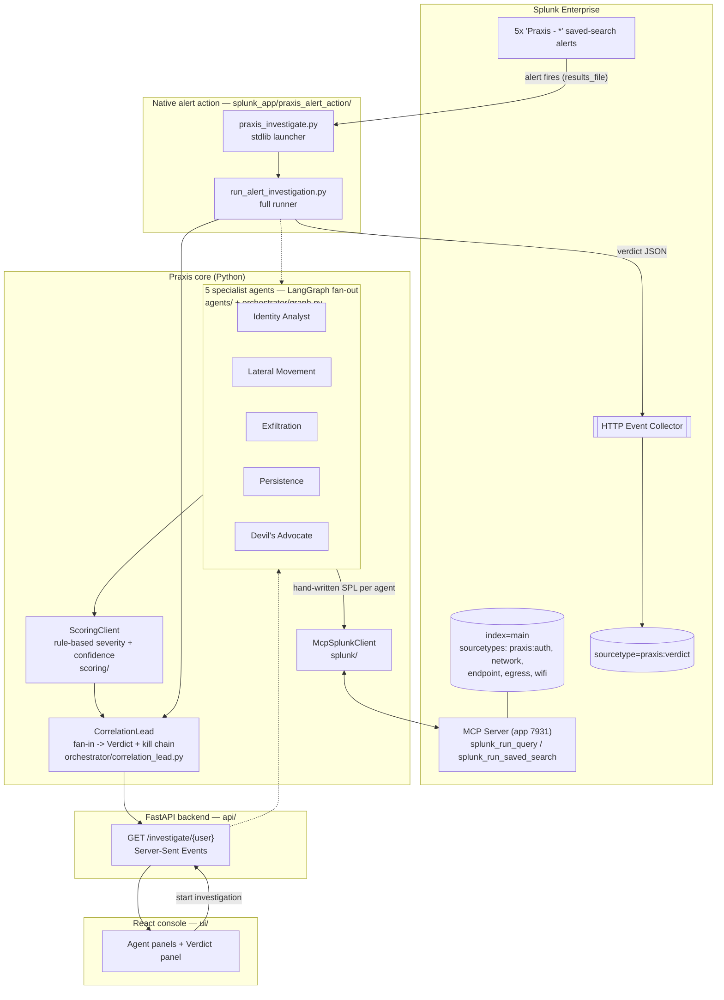
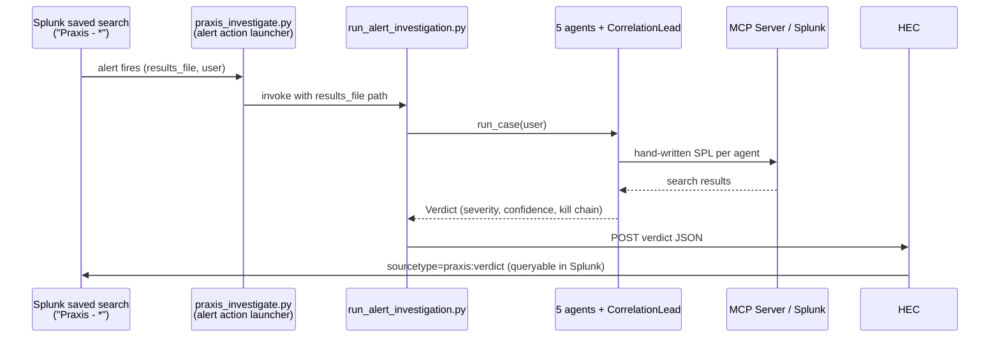

# Praxis Architecture

Praxis has two entry points — an interactive React console and a native
Splunk alert action — that both drive the **same** investigation pipeline:
5 specialist agents read real Splunk data through one MCP client, a
rule-based scorer rates each finding, and a Correlation Lead synthesizes
everything into a single verdict with a reconstructed kill chain. The
verdict can be streamed to a human (SSE) and/or written back into Splunk
(HEC), closing the loop.

## Component diagram



## How Praxis interacts with Splunk

| Direction | Mechanism | Where |
|---|---|---|
| Read | MCP Server (app 7931) — `splunk_run_query`, `splunk_run_saved_search` | `splunk/mcp_client.py` (`McpSplunkClient`), used by every agent |
| Trigger | 5 `Praxis - *` saved-search alerts + a custom alert action (`alert_actions.conf`) | `scripts/create_saved_searches.py`, `splunk_app/praxis_alert_action/` |
| Write-back | HTTP Event Collector (HEC) | `scripts/run_alert_investigation.py` writes `sourcetype=praxis:verdict` |

Every agent issues hand-written SPL (no `saia_*`/MLTK dependency — see
[`scripts/verify_live.py`](scripts/verify_live.py) and the "MCP Known
Issues" notes in this repo) against `index=main`, scoped to the
investigated user and an `earliest_time` window.

## How AI agents are integrated

Praxis is a **multi-agent system orchestrated with LangGraph**
(`orchestrator/graph.py`):

1. **Fan-out** — `IdentityAnalystAgent`, `LateralMovementAgent`,
   `ExfiltrationAgent`, `PersistenceAgent`, and `DevilsAdvocateAgent` each
   run independently and in parallel for the target user, each querying a
   different attack discipline (impossible travel/MFA fatigue, lateral
   movement + Wi-Fi access-point integrity, DNS tunneling/egress,
   persistence, and mitigating evidence respectively).
2. **Score** — every `Finding` is scored by the deterministic
   `ScoringClient` (`scoring/client.py`): field-threshold rules map to a
   `Severity` (low/medium/high/critical) and a confidence score. This is
   intentionally rule-based, not LLM-based, for speed and determinism (see
   `scoring/client.py`'s module docstring).
3. **Fan-in** — `CorrelationLead` (`orchestrator/correlation_lead.py`)
   counts how many distinct agents independently flagged elevated severity,
   builds a time-ordered kill chain across all findings, and folds in any
   Devil's Advocate dissent to produce one `Verdict`.

The same graph is invoked from two callers: the FastAPI SSE endpoint
(`api/main.py`, for the interactive UI) and the native alert-action runner
(`scripts/run_alert_investigation.py`, for the closed loop below).

## Closed loop: Splunk alert -> investigation -> Splunk verdict



Verified end-to-end against live Splunk via
[`scripts/verify_alert_action.py`](scripts/verify_alert_action.py).

## Data flow between services, APIs, and components

```
User (browser)
  -> React console (ui/, Vite dev server :5173)
  -> FastAPI (api/main.py, :8000) GET /investigate/{user}  [SSE]
  -> LangGraph orchestrator (orchestrator/graph.py)
       -> 5 specialist agents (agents/*.py), in parallel
            -> McpSplunkClient (splunk/mcp_client.py)
                 -> MCP Server (app 7931) -> Splunk index=main
            <- raw search results (events as dicts)
       -> ScoringClient (scoring/client.py) -> Finding (severity, confidence, rationale)
       -> CorrelationLead (orchestrator/correlation_lead.py) -> Verdict + kill chain
  <- streamed back to the UI as SSE events (one per agent, then the verdict)

Splunk saved-search alert ("Praxis - *")
  -> custom alert action (splunk_app/praxis_alert_action/bin/praxis_investigate.py)
  -> scripts/run_alert_investigation.py
       -> same orchestrator pipeline as above
       -> HEC POST -> sourcetype=praxis:verdict (back into index=main)
```
