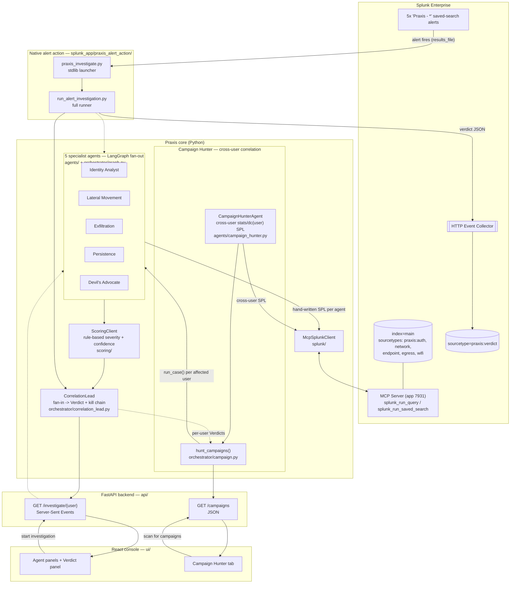
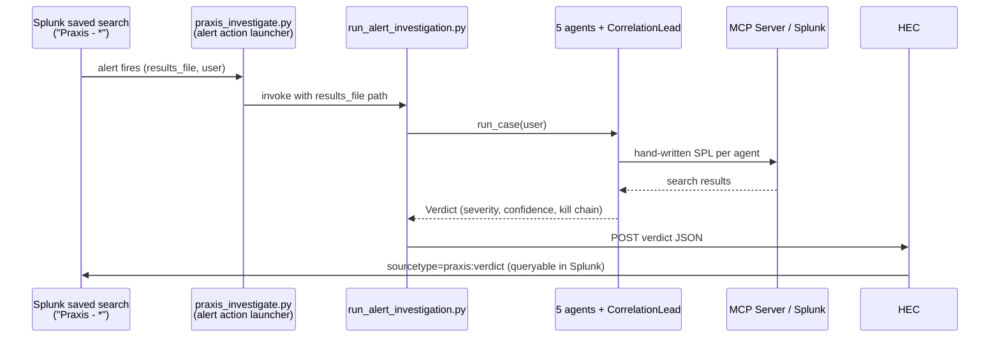

# Praxis — Architecture Diagram

High-level component diagram for Praxis. For the full narrative
(how Praxis talks to Splunk, how the AI agents are integrated, and a
text-form data-flow walkthrough for every request path), see
[`ARCHITECTURE.md`](ARCHITECTURE.md).

## Component diagram



## Closed loop: Splunk alert -> investigation -> Splunk verdict



## Request-level data flow

```
User (browser)
  -> React console (ui/, Vite dev server :5173)
  -> FastAPI (api/main.py) GET /investigate/{user}  [SSE]
  -> LangGraph orchestrator (orchestrator/graph.py)
       -> 5 specialist agents (agents/*.py), in parallel
            -> McpSplunkClient (splunk/mcp_client.py)
                 -> MCP Server (app 7931) -> Splunk index=main
            <- raw search results (events as dicts)
       -> ScoringClient (scoring/client.py) -> Finding (severity, confidence, rationale)
       -> CorrelationLead (orchestrator/correlation_lead.py) -> Verdict + kill chain
  <- streamed back to the UI as SSE events (one per agent, then the verdict)

User (browser)
  -> React console "Campaign Hunter" tab
  -> FastAPI GET /campaigns  [JSON]
  -> hunt_campaigns (orchestrator/campaign.py)
       -> CampaignHunterAgent (agents/campaign_hunter.py)
            -> McpSplunkClient -> cross-user stats/dc(user) SPL -> Splunk index=main
       -> for each affected user: run_case (same pipeline as /investigate)
       -> merge per-user Verdicts -> CampaignVerdict (level, summary, combined kill chain)
  <- single JSON response with one CampaignVerdict per detected campaign

Splunk saved-search alert ("Praxis - *")
  -> custom alert action (splunk_app/praxis_alert_action/bin/praxis_investigate.py)
  -> scripts/run_alert_investigation.py
       -> same orchestrator pipeline as above
       -> HEC POST -> sourcetype=praxis:verdict (back into index=main)
```
